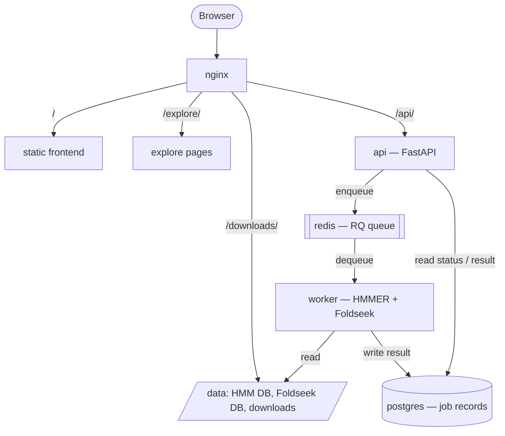

# EVADES web app

Self-hosted companion site for the EVADES database of anti-defence
proteins (ADPs). It offers three things:

- **Browse** — one page per ADP, pre-rendered as static HTML from the
  EVADES dataset (see `generator/README.md`).
- **Analyse** — search your own data against EVADES: profile HMM
  search (HMMER `hmmsearch`) against the EVADES HMM library, and
  structure search (Foldseek) against the EVADES structure set.
- **Download** — bulk data files (sequences, metadata, structures, HMM
  profiles).

The site has no runtime dependency on EBI infrastructure. It is a
small set of containers defined in `docker-compose.yml`: run locally
with Docker Compose for development, deployed to Kubernetes
(EMBL-EBI) for production.

## Architecture

Every box below is one container. `docker-compose.yml` is the
authoritative list.

| Component | Role |
|---|---|
| **nginx** | The only entry point. Routes by URL path: the static frontend, the `/explore/` pages, the `/downloads/` files, and `/api/` to the api container. |
| **frontend** | Static HTML/JS (`frontend/`), served straight from disk by nginx. No build step. |
| **explore pages** | Pre-rendered per-protein HTML (`frontend/explore/`), generated offline — not built at deploy time. Served by nginx. |
| **api** (FastAPI) | Accepts an upload, validates it, and puts a job on the queue. Returns a job id immediately. Never runs HMMER or Foldseek itself; reads job status and results back from Postgres. |
| **redis** | Holds the [RQ](https://python-rq.org/) job queue. Decouples "user clicked Run" from "a search is actually running". |
| **worker** | The only place HMMER and Foldseek run. Takes a job off the queue, runs the tool against the databases in `/data`, writes the parsed result to Postgres. This is the piece you scale for concurrency. |
| **postgres** | Job bookkeeping only — job id, type, status, result JSON. No scientific data. Reproducible and safe to lose. |
| **/data** | Reference data mounted read-only into api / worker / nginx: the pressed HMM library, the Foldseek database, and the bulk-download files. Not in git — see [Reference data](#reference-data-not-in-git). |



A search, end to end:

1. The browser uploads a FASTA (HMM search) or a PDB/mmCIF file
   (structure search) to `POST /api/search/hmm` or
   `POST /api/search/structure`.
2. `api` validates the file, saves it to the shared uploads volume,
   enqueues a job on redis, writes a `queued` row to Postgres, and
   returns a job id right away.
3. A free `worker` picks up the job, runs `hmmsearch` or `foldseek`
   against `/data`, and writes the result to Postgres.
4. The browser polls `GET /api/jobs/{id}` until the status is
   `finished` (or `failed`), then renders the result.

Step 2 returns instantly no matter how busy the system is, so
submissions never block or fail under load — they queue. How many run
in parallel rather than wait depends only on the number of `worker`
replicas.

## Quick start (local)

1. Put the reference data in place — see `data/README.md` and
   [Reference data](#reference-data-not-in-git).
2. `cp .env.example .env` (the defaults are fine for local dev).
3. `docker compose up --build`
4. Open `http://localhost:8080`.

To put this online at **`https://www.ebi.ac.uk/finn-srv/evades/`**, see
[Going live](#going-live-kubernetes-at-wwwebiacukfinn-srvevades).

Backend tests and lint:

```bash
cd backend
pip install -r requirements-dev.txt
ruff check . && pytest
```

CI (`.github/workflows/ci.yml`) runs the same checks plus a Docker
image build on every push and pull request.

## Reference data (not in git)

Four artifacts are generated or scientific data, not source. They are
gitignored and delivered separately from the code:

| Path | What | Produced by |
|---|---|---|
| `data/hmm/evades_profiles.hmm*` | Pressed HMM profile library | `data/README.md` |
| `data/foldseek/evades_structures_db*` | Foldseek database (268 structures) | `foldseek createdb`, per `data/README.md` |
| `data/downloads/*` | The four bulk-download files | dataset export |
| `frontend/explore/` | Pre-rendered Browse pages | `generator/export_static.py` — see `generator/README.md` |

For local development, drop each at the path above. For the
Kubernetes deployment they need an **out-of-band delivery path** —
an object store the pods sync from, or a pre-populated volume —
because there is no SSH access to the running service. Wiring this up
is the main open item for the production move.

Updates to this data are expected roughly once a year and are
additive (more entries), not functional changes. Regenerate
`frontend/explore/` and the Foldseek DB **together** from the dataset
— see the blob-wipe footgun documented in `generator/README.md`.

## Going live (Kubernetes, at `www.ebi.ac.uk/finn-srv/evades/`)

The predecessor site (`EBI-Metagenomics/anti_defence`) already ran at
this exact URL on EBI's Kubernetes. Its manifest
(`website/deployment/ebi-wp-k8s-hl.yaml` in that repo) is the template
for this deployment, and the notes below are taken from it.

### The URL prefix — stripped before it reaches the app

`www.ebi.ac.uk` routes `/finn-srv/evades/...` to the cluster through an
ingress-nginx rule that **removes the prefix**:

```yaml
metadata:
  annotations:
    kubernetes.io/ingress.class: "nginx"
    nginx.ingress.kubernetes.io/rewrite-target: /$2
spec:
  rules:
    - host: www.ebi.ac.uk
      http:
        paths:
          - path: /finn-srv/evades(/|$)(.*)   # $2 = everything after the prefix
```

So a request for `…/finn-srv/evades/api/health` arrives at the backend
as `/api/health`. Consequences:

- **`nginx/default.conf` needs no changes** — it stays rooted at `/`.
- **HTTPS is terminated upstream** by EBI's www tier; the ingress has
  no TLS block and the app manages no certificates (no Caddy).
- Only the **browser-facing HTML** has to carry the prefix, so that the
  browser's *next* request goes back through `/finn-srv/evades/...`
  (steps 2–3 below). There is no `BASE_URL`-style env var for this app;
  the prefix lives in `<base href>` and the generator's `SCRIPT_PREFIX`.

### How the containers map to Kubernetes

`docker-compose.yml` is a single-VM stand-in; on the cluster it becomes:

| Compose service | Kubernetes | Notes |
|---|---|---|
| nginx | Deployment + Service (`NodePort`, as in the anti_defence manifest) | the Ingress `backend.service` points here |
| frontend / explore pages | files inside the nginx image | rebuilt on change; acceptable given ~annual updates |
| api | Deployment + ClusterIP Service (`:8000`) | readiness probe on `/api/health` |
| worker | Deployment, `replicas: N` | queue consumer, no Service; the concurrency knob (`--scale worker=N`) |
| redis | Deployment + ClusterIP Service | ephemeral — no PVC |
| postgres | StatefulSet + PVC (`ReadWriteOnce`) + a `Secret` for the password | or a managed instance; the old site used sqlite-on-NFS and has no equivalent to copy |
| `/data/uploads` | `ReadWriteMany` NFS PVC shared by api + worker | or co-locate api + worker in one Pod sharing an `emptyDir` (simpler; gives up independent worker scaling) |
| `/data` reference data | `ReadOnlyMany` NFS PV/PVC — see below | |

### Reference data on the cluster — a static NFS volume

This is the no-SSH delivery path. The anti_defence manifest mounts a
statically-provisioned NFS volume:

```yaml
kind: PersistentVolume
spec:
  accessModes: [ReadOnlyMany]
  mountOptions: [nfsvers=3]
  nfs:
    server: hh-isi-srv-vlan1496.ebi.ac.uk
    path: /ifs/public/services/metagenomics/evades/dbs
```

The web team places the files on that export; pods mount it read-only.
The old site then had a busybox **initContainer** copy them to a local
`emptyDir` (sqlite needs a writable file) — the HMM and Foldseek
databases here are genuinely read-only at query time, so api/worker can
mount the NFS PVC directly and skip the copy. Size the PV/PVC to the
data (a few hundred MB today; the old `1Gi` is on the low side — use
2–5Gi).

### Steps

1. **Coordinate with the EBI web team** on the namespace (`evades`),
   the Ingress rule (reuse the pattern above, pointed at the nginx
   Service), and the NFS export path for the reference data.
2. **Set the frontend base path.** In `frontend/index.html`, change
   `<base href="/">` to `<base href="/finn-srv/evades/">`. Every link
   in `index.html` / `app.js` is relative, so that is the only change
   there.
3. **Regenerate the Explore pages for the new path.** In
   `generator/export_static.py` set
   `SCRIPT_PREFIX = "/finn-srv/evades/explore/"` (the "back to home"
   link is derived from it automatically), then re-run the generator
   — see `generator/README.md`. The generated HTML bakes in absolute
   paths, so a build made for local `/explore/` will 404 its CSS and
   links under `/finn-srv/evades/`.
4. **Set CORS.** `CORS_ORIGINS=https://www.ebi.ac.uk,https://evades.mgnify.org`
   on the api Deployment — the anti_defence config allowed both
   `www.ebi.ac.uk` and the `evades.mgnify.org` vanity domain.
5. **Build and publish the images.** The anti_defence site built on
   push to `main` and pushed to `quay.io/microbiome-informatics/…`,
   pulled in-cluster with an `imagePullSecrets` entry. Mirror that for
   the `api`/`worker`/`nginx` images (this repo's CI already builds
   them; add the registry push).
6. **Create the Kubernetes resources** per the table above: Deployments
   + Services for nginx / api / redis, a Deployment for worker, a
   StatefulSet + PVC (or managed DB) for postgres, the `ReadOnlyMany`
   NFS PV/PVC for `/data`, an upload volume shared by api + worker, and
   the Ingress. (Outbound internet on the cluster only works via the
   proxy `http://hh-wwwcache.ebi.ac.uk:3128` — this app makes no
   outbound calls at runtime, so that is not needed here.)
7. **Load the reference data** onto the NFS export (step 1) — the
   `data/hmm`, `data/foldseek`, and `data/downloads` contents. The
   Explore pages ship in the nginx image, so a data-only refresh is
   just replacing files on the export; a dataset change also means a
   new nginx image (step 3 + step 5).
8. **Deploy** by merging to `main`: CI builds and pushes the images,
   the rollout picks them up.
9. **Verify:** `https://www.ebi.ac.uk/finn-srv/evades/` loads;
   `…/api/health` returns `{"status": "ok"}`; a test HMM search and a
   test structure search both complete; `…/explore/protein_list/`
   renders with styling; the four `…/downloads/*` files serve.

### Operational model

- **No SSH, no in-place edits.** All changes ship through git:
  PR → review → merge → CI builds images → rollout.
- **Concurrency.** Each job is capped at 2 threads
  (`hmmsearch --cpu 2`, `foldseek --threads 2`), so replicas don't
  fight over every core. Rule of thumb: **worker CPU ≈ 2 × the number
  of searches you want running genuinely in parallel.** Past that,
  jobs wait in the queue for a few seconds rather than failing. One
  worker replica covers the expected traffic; raise `replicas` if that
  changes.
- **State.** Only Postgres and the uploads volume hold state, and
  neither holds scientific data — job rows are bookkeeping, uploads
  are transient. Everything else is reproducible from git plus the
  reference data. Backups are optional.

`OPERATIONS.md` describes the current interim single-VM deployment; it
will be superseded once this is in place.
